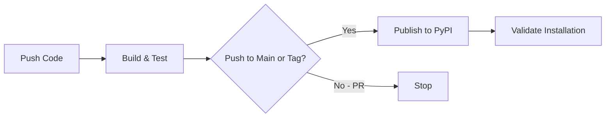

# Azure Bootstrap Library - AI Assistant Context

> Complete context for AI assistants working on the Azure Bootstrap library repository.

## Repository Purpose

This repository contains the **Azure Bootstrap Library** - a production-ready pip package that provides unified bootstrap functionality for Azure Functions applications across multiple organizations.

**Package Name**: `azure-bootstrap`
**Version**: 2.0.0
**Language**: Python 3.11+
**Distribution**: PyPI (public)

## What This Library Does

v1 solved the **logging ↔ configuration circular dependency** that bites
every Azure Functions app at startup. v2 expands that surface to cover
the entire cross-cutting layer — structured logging, tracing, tiered
alerts, error vocabulary, ingress hardening, Service Bus consumer
plumbing, webhook auth, AI usage tracking, health probes, dynamic log
refresh, DLQ digest, and more.

### v1 surface (preserved byte-identical in v2)

1. **Bootstrap Logging** — works immediately, before configuration loads
2. **Configuration Loading** — Azure App Configuration + Key Vault
3. **Telemetry Setup** — Application Insights via OpenTelemetry
4. **Environment Loading** — all configs auto-loaded to `os.environ`

### v2 additions (additive, opt-in via pip extras)

30+ new subpackages across three tiers. See [CHANGELOG.md](CHANGELOG.md)
for the catalog, [examples/README.md](examples/README.md) for a reading
order, and [MIGRATING-FROM-V1.md](MIGRATING-FROM-V1.md) for the adoption
path.

### The Original Problem (v1)

**Chicken-and-egg**:
- Configuration loading needs logging to track progress
- Logging (App Insights) needs configuration to initialize

**v1 solution** (still how v2 works under the hood):
1. Start with console logging (always works)
2. Try App Insights from environment if available
3. Load configuration from App Config/Key Vault
4. Upgrade to App Insights if connection string now available
5. Load all configs to os.environ

## Repository Structure

```
azure-bootstrap/
├── azure_bootstrap/              # Main package (distributable)
│   ├── __init__.py                   # Public API surface (v1 + v2 re-exports)
│   ├── py.typed                      # PEP 561 type hints marker
│   │
│   │  ── v1 (preserved unchanged) ─────────────────────────────────────
│   ├── models/                       # ConfigurationError / RepositoryError / KeyVaultError
│   ├── repositories/                 # App Config + Key Vault loaders + interfaces
│   ├── services/                     # ApplicationBootstrap, BootstrapLogger, TelemetryManager
│   │
│   │  ── v2 Tier 1 (always-on, stdlib only) ───────────────────────────
│   ├── logging/                      # configure_logging, formatter, masking, correlation, noise
│   ├── tracing/                      # @traced, latency, slow_thresholds, timed_operation
│   ├── counters/                     # bump_counter, counter_snapshot
│   ├── bootstrap/                    # ensure_bootstrap, load_local_settings
│   ├── exceptions/                   # PipelineError tree + is_unrecoverable
│   ├── softfail/                     # soft_fail, soft_fail_with
│   ├── phases/                       # run_phase, run_phases
│   ├── validation/                   # queue_message_schema, validate_message
│   ├── path_safety/                  # sanitize_path_segment, confine_to_root
│   ├── security/                     # compare_secrets, verify_api_key_header
│   ├── identity/                     # build_credential, credential_health
│   ├── audit/                        # build_audit_extra
│   ├── failclose/                    # require_env, optional_env, fail_open_env
│   │
│   │  ── v2 Tier 2 (opt-in extras) ────────────────────────────────────
│   ├── alerts/                       # alert_dev_team + dispatcher + escalation + render
│   ├── health/                       # check_app_config_health / app_insights / handler-detect
│   ├── fastapi_middleware/           # install_middleware
│   ├── heartbeat/                    # background heartbeat + consumer watchdog
│   ├── config_refresh/               # refresh_log_flags
│   ├── retry/                        # build_retry + Azure/AI presets
│   ├── ingress/                      # 4-gate attachment classifier (ext → MIME → size → magic)
│   ├── ratelimit/                    # TokenBucket + webhook/admin presets
│   ├── notify/                       # two-tier notification builders + sender throttle
│   ├── subscription/                 # ensure_resource + renewal_loop (5s slices for SIGTERM)
│   ├── auth/                         # install_graph_webhook_route + WebhookDedup + API-key
│   │
│   │  ── v2 Tier 3 (advanced opt-in) ──────────────────────────────────
│   ├── servicebus/                   # handle_message + DLQ digest + growth alarm
│   │   ├── consumer.py / consumer_wrapper.py / dlq_alarm.py / dlq_digest.py
│   ├── openai/                       # AI usage tracker (SDK-agnostic)
│   ├── tokens/                       # issue/verify_action_token (HMAC-SHA256)
│   ├── scheduler/                    # parse_cron_trigger (NCRONTAB)
│   ├── metrics/                      # build_metrics_snapshot
│   ├── pdf_safety/                   # sanitize_pdf_for_passthrough
│   └── sb_lock/                      # lock_for_process, ManagedLock
│
├── test/                             # Test suite (423 tests, 87.07% coverage)
│   ├── alerts/ audit/ auth/ bootstrap/ config_refresh/ counters/
│   ├── exceptions/ failclose/ fastapi/ health/ heartbeat/ identity/
│   ├── ingress/ logging/ metrics/ notify/ openai/ path_safety/ phases/
│   ├── pdf_safety/ ratelimit/ repositories/ retry/ sb_lock/ scheduler/
│   ├── security/ servicebus/ services/ softfail/ subscription/ tokens/
│   ├── tracing/ validation/
│   └── conftest.py              # AZURE_BOOTSTRAP_ALLOW_RESET=1 set here
│
├── examples/                         # Examples library (see examples/README.md)
│   ├── README.md                         # Index + reading order
│   ├── 01_quickstart.py … 37_metrics_endpoint.py
│   ├── e2e_azure_function.py             # v2 successor to function_app_example
│   ├── e2e_fastapi_pipeline.py
│   ├── e2e_aks_sb_worker.py
│   ├── function_app_example.py           # v1 reference (kept for back-compat)
│   └── local.settings.json.example
│
├── .github/workflows/ci-cd.yml       # GitHub Actions CI/CD
├── .githooks/                        # Git hooks (pre-commit, pre-push)
├── .vscode/                          # VS Code workspace config
├── pyproject.toml                    # Package metadata + ~22 optional extras
├── MANIFEST.in                       # Distribution file control
├── README.md                         # Library overview + extras matrix
├── CHANGELOG.md                      # Release-by-release surface (v1.0.0, v2.0.0)
├── MIGRATING-FROM-V1.md              # v1 → v2 adoption guide
├── CLAUDE.md                         # AI assistant & developer context (this file)
├── CONTRIBUTING.md                   # Contribution guidelines
└── LICENSE                           # MIT
```

## Key Concepts

### 1. Bootstrap Flow (4 Phases)

```python
# Phase 1: Bootstrap Logging
BootstrapLogger.configure_bootstrap_logging()
# → Console logging works immediately

# Phase 2: Initial Telemetry
telemetry_manager.configure()
# → Try App Insights from APPLICATIONINSIGHTS_CONNECTION_STRING env var

# Phase 3: Configuration Loading
config_repo = create_enhanced_config_repository(
    app_config_connection_string=conn_str,
    auto_load_to_environ=True
)
# → Load from Azure App Configuration
# → Resolve Key Vault references
# → Load all to os.environ

# Phase 4: Telemetry Upgrade
telemetry_manager.try_upgrade_from_config(config_repo)
# → Upgrade to App Insights if connection string now available
```

### 2. Configuration Precedence (Hierarchical)

**Priority Order** (highest to lowest):
1. **Environment variables** (`os.environ`) - Local overrides ALWAYS win
2. **Azure App Configuration** - Centralized config
3. **Key Vault secrets** (via App Config references) - Secure secrets
4. **Default values** - Fallback

**Example**:
```python
# local.settings.json sets:
USE_MOCK_DB = "true"

# App Config has:
USE_MOCK_DB = "false"
NEW_SETTING = "value"

# After initialize_application():
os.getenv("USE_MOCK_DB")  # → "true" (local preserved!)
os.getenv("NEW_SETTING")   # → "value" (remote added)
```

### 3. Automatic Key Vault Resolution

App Configuration can reference Key Vault secrets:

```json
// In App Config:
{
  "DATABASE_PASSWORD": {
    "uri": "https://myvault.vault.azure.net/secrets/db-password"
  }
}

// After bootstrap:
os.getenv("DATABASE_PASSWORD")  // → Actual secret value (not URI)
```

### 4. Graceful Fallbacks

- Missing App Configuration → Use environment variables only
- Missing Key Vault → Use environment variables only
- Missing App Insights → Use console logging only
- Import errors → Graceful warnings, continue with reduced functionality

## Public API

### v1 — Main Functions (preserved unchanged)

```python
from azure_bootstrap import initialize_application, get_bootstrap_logger

logger = get_bootstrap_logger(__name__)
config_repo = initialize_application()
# All configs now in os.environ
```

### v1 — Core Classes (advanced usage, preserved unchanged)

```python
from azure_bootstrap import (
    ApplicationBootstrap,          # Bootstrap orchestrator
    EnhancedConfigRepository,      # Config repository
    SecretsRepository,             # Key Vault secrets
    TelemetryManager,              # Telemetry manager
    telemetry_manager,             # Singleton instance
)
```

### v2 — Top-level re-exports (additive)

The most-used v2 primitives are re-exported from the top-level namespace:

```python
from azure_bootstrap import (
    # Logging
    configure_logging, correlation_scope, get_correlation_id,
    mask_api_key, mask_email_address, mask_secrets_in_dict, sanitize_for_log,
    # Tracing + counters
    traced, latency_snapshot, bump_counter, counter_snapshot,
    # Bootstrap helpers
    ensure_bootstrap, bootstrap_initialized, load_local_settings, refresh_setting,
    # Exception hierarchy
    PipelineError, UnrecoverableError, TransientError,
    InvalidMessageError, RateLimitError, NetworkError, is_unrecoverable,
    # Soft-fail + phases + validation
    soft_fail, soft_fail_with, SoftFailResult,
    run_phase, run_phases, PhaseResult,
    validate_message, MessageSchema, queue_message_schema,
    # Path / security
    sanitize_path_segment, confine_to_root, compare_secrets,
)
```

Everything else (alerts, fastapi_middleware, identity, audit, failclose,
auth, sb_lock, servicebus.*, openai.*, etc.) is reachable via its
subpackage import path.

### Interfaces (Type hints & custom implementations)

```python
from azure_bootstrap.repositories.interfaces import (
    EnhancedConfigRepositoryInterface,
    SecretsRepositoryInterface,
)
from azure_bootstrap.services.interfaces import (
    ApplicationBootstrapInterface,
    TelemetryManagerInterface,
)
```

## Development Workflow

### Setup Development Environment

```bash
# Clone repository
git clone https://github.com/TheViziusGroup/azure-bootstrap
cd azure-bootstrap

# Create virtual environment
python -m venv .venv
.venv\Scripts\activate  # Windows

# Install in editable mode with dev dependencies
pip install -e ".[dev]"
```

### Run Tests

```bash
# Run all tests with coverage
pytest

# Run specific test
pytest test/services/test_application_bootstrap.py -v

# Generate coverage report
pytest --cov=azure_bootstrap --cov-report=html
```

### Build Package

```bash
# Install build tools
pip install build

# Build wheel and sdist
python -m build

# Output:
# dist/azure_bootstrap-2.0.0-py3-none-any.whl
# dist/azure_bootstrap-2.0.0.tar.gz
```

### Publish to PyPI

```bash
# Manual publish
pip install twine
twine upload dist/*

# Or push to main (automated via pipeline)
git push origin main
```

## Code Guidelines

### Import Conventions

```python
# ALWAYS use package imports (never relative)
from azure_bootstrap.services.bootstrap_logging import BootstrapLogger

# NOT this:
from .bootstrap_logging import BootstrapLogger
```

### Public API Exports

All public API must be exported in `azure_bootstrap/__init__.py`:

```python
# azure_bootstrap/__init__.py
from azure_bootstrap.services.application_bootstrap import (
    initialize_application,  # Main function
    create_enhanced_config_repository,
)

__all__ = [
    "initialize_application",
    "create_enhanced_config_repository",
    # ... all public exports
]
```

### Interface Pattern

All core components implement interfaces:

```python
# 1. Define interface
class TelemetryManagerInterface(ABC):
    @abstractmethod
    def configure(self) -> None:
        pass

# 2. Implement interface
class TelemetryManager(TelemetryManagerInterface):
    def configure(self) -> None:
        # Implementation
        pass

# 3. Use interface for type hints
def use_telemetry(manager: TelemetryManagerInterface) -> None:
    manager.configure()
```

### Error Handling

Use custom exceptions from `models.exceptions`:

```python
from azure_bootstrap.models.exceptions import ConfigurationError

raise ConfigurationError("Config not found: DATABASE_HOST")
```

### Logging Pattern

```python
logger.info(
    "Processing started",
    extra={
        "operation": "operation_name",
        "component": "ComponentName",
        "custom_field": value,
    }
)
```

## Testing Guidelines

### Test Structure

```python
class TestApplicationBootstrap:
    def setup_method(self):
        """Setup before each test."""
        self.original_env = os.environ.copy()

    def teardown_method(self):
        """Cleanup after each test."""
        os.environ.clear()
        os.environ.update(self.original_env)

    def test_specific_behavior(self):
        """Test description."""
        # Arrange
        os.environ["KEY"] = "value"

        # Act
        result = function_under_test()

        # Assert
        assert result == expected
```

### Mocking Pattern

```python
@patch("azure_bootstrap.services.application_bootstrap.telemetry_manager")
def test_with_mock(mock_telemetry):
    mock_telemetry.configure.return_value = None
    # Test code
```

### Coverage Requirements

- Minimum: 85% overall coverage (raised from 80% at v2.0.0)
- Current: 87.07% overall, 423 passing tests
- New code: 90% coverage
- Run: `pytest --cov=azure_bootstrap --cov-report=term-missing`

Every subpackage with global state (counters, latency histograms,
alerts dispatcher, etc.) exposes a `reset_state()` / `_reset_*` helper
gated by `AZURE_BOOTSTRAP_ALLOW_RESET=1`. The test suite sets this
once via `test/conftest.py`; production code MUST NOT set it.

## CI/CD Pipeline

### Pipeline Stages

1. **Build** - Install dependencies, run tests, build package
2. **Publish** - Upload to PyPI (main branch only)
3. **Validate** - Test installation from feed

### Triggers

- **Push to main** → Full pipeline with publish
- **Pull requests** → Build and test only
- **Tags (v*)** → Full pipeline with publish

### Pipeline Configuration

See `azure-pipelines.yml` for complete configuration.

## Version Management

### Semantic Versioning

- **Major (X.0.0)** - Breaking API changes
- **Minor (0.X.0)** - New features (backwards compatible)
- **Patch (0.0.X)** - Bug fixes

### Release Process

1. Update version in `pyproject.toml`
2. Update version in `azure_bootstrap/__init__.py`
3. Append a section to `CHANGELOG.md` (the authoritative changelog)
4. Mirror a short summary in the Version History section of this file
5. Commit and tag: `git tag v2.x.y`
6. Push: `git push origin main --tags`
7. Pipeline automatically publishes to PyPI via OIDC Trusted Publisher

## Common Tasks

### Adding a New Feature

1. Create feature branch: `git checkout -b feature/new-feature`
2. Add code to the appropriate subpackage (Tier 1/2/3 — match the
   existing layout described under Repository Structure)
3. Add tests (maintain ≥ 85% coverage; aim for 90% on new code)
4. Update `azure_bootstrap/__init__.py` if the feature belongs in the
   top-level surface (most subpackage-specific features don't)
5. Add a numbered example under [examples/](examples/) and a row in
   [examples/README.md](examples/README.md)
6. Append a section to [CHANGELOG.md](CHANGELOG.md)
7. Update the Version History section here
8. Create PR

### Fixing a Bug

1. Create bugfix branch: `git checkout -b bugfix/issue-description`
2. Add failing test that reproduces bug
3. Fix bug
4. Ensure test passes
5. Note the fix in [CHANGELOG.md](CHANGELOG.md) under the next release
6. Create PR

### Updating Dependencies

1. Update `pyproject.toml` dependencies section (core or optional extras)
2. Test with new versions: `pip install -e ".[dev]"`
3. Run full test suite: `pytest`
4. Note the bump in [CHANGELOG.md](CHANGELOG.md)
5. Create PR

## Troubleshooting

### Tests Failing

```bash
# Clean environment
rm -rf .venv
python -m venv .venv
.venv\Scripts\activate
pip install -e ".[test]"
pytest -v
```

### Import Errors in Tests

Check that all imports use `azure_bootstrap` prefix:

```bash
# Find any old src imports
grep -r "from src\." .
```

### Build Fails

```bash
# Check package structure
python -m build --sdist --wheel --outdir dist/ .

# Verify no syntax errors
python -m py_compile azure_bootstrap/**/*.py
```

### Package Import Fails

```bash
# Verify package installed
pip show azure-bootstrap

# Test import
python -c "from azure_bootstrap import initialize_application; print('OK')"
```

## Related Projects

This library is used across 17+ repositories:

- **Service A** - AI Assistant + Vector Store Manager
- **Service B** - Excel Operations Processor
- **Service C** - Email Ingestion Service
- ... (13 more)

For v0 → v1 migration (extracting embedded `src/infrastructure/`), see
the README at the `1.0.0` tag in git history. For v1 → v2 adoption, see
[MIGRATING-FROM-V1.md](MIGRATING-FROM-V1.md).

## Dependencies

### Core Dependencies

```toml
azure-appconfiguration-provider >= 1.0.0
azure-keyvault-secrets >= 4.7.0
azure-identity >= 1.15.0
azure-monitor-opentelemetry >= 1.2.0
opentelemetry-api >= 1.22.0
opentelemetry-instrumentation-azure-functions >= 0.45b0

# Pinned for CVE remediation:
azure-core >= 1.38.0      # CVE-2026-21226
filelock >= 3.20.3        # CVE-2025-68146, CVE-2026-22701
urllib3 >= 2.6.3          # CVE-2026-21441
```

### Optional Dependencies (v2.0.0 — ~22 extras)

See [pyproject.toml](pyproject.toml) and the **Installation** table in
[README.md](README.md) for the full extras matrix. Highlights:

```toml
# Tier 2 (opt-in primitives)
fastapi   = ["fastapi>=0.110"]
retry     = ["tenacity>=8.0"]
scheduler = ["apscheduler>=3.10"]
servicebus = ["azure-servicebus>=7.11"]

# Tier 3 (advanced opt-in)
pdf-safety = ["pypdf>=4.0"]

# Aggregate
all = ["fastapi>=0.110", "azure-servicebus>=7.11", "apscheduler>=3.10",
       "tenacity>=8.0", "pypdf>=4.0"]

# dev - Development tools
pytest >= 7.4.0
pytest-cov >= 4.1.0
black >= 23.7.0
ruff >= 0.0.285

# test - Testing only
pytest >= 7.4.0
pytest-cov >= 4.1.0
pytest-mock >= 3.11.1
```

## Key Files Reference

| File | Purpose |
|------|---------|
| **azure_bootstrap/__init__.py** | Public API exports - ALWAYS update when adding public functions |
| **pyproject.toml** | Package metadata, dependencies, build configuration |
| **MANIFEST.in** | Controls what gets included in distribution |
| **.github/workflows/ci-cd.yml** | GitHub Actions CI/CD workflow |
| **README.md** | Library documentation, API reference, migration guide |
| **CONTRIBUTING.md** | Git workflow, quality standards, tooling setup |

## Documentation for Users

When users install this library, they should read:

1. **[README.md](README.md)** — Library overview + extras matrix
2. **[examples/README.md](examples/README.md)** — Reading order through
   the ~40 example files (start at 01_quickstart.py)
3. **[MIGRATING-FROM-V1.md](MIGRATING-FROM-V1.md)** — v1 → v2 upgrade
4. **[CHANGELOG.md](CHANGELOG.md)** — Full release-by-release surface

## Quick Reference

### Most Common User Pattern

```python
from azure_bootstrap import initialize_application, get_bootstrap_logger

_bootstrap_initialized = False
_logger = None

def _ensure_bootstrap():
    global _bootstrap_initialized, _logger
    if _bootstrap_initialized:
        return

    _logger = get_bootstrap_logger(__name__)
    config_repo = initialize_application()
    _bootstrap_initialized = True

# Use in Azure Functions
app = func.FunctionApp()

@app.route(route="hello")
def hello(req):
    _ensure_bootstrap()
    # All configs in os.environ
```

## Support

- **Repository**: https://github.com/TheViziusGroup/azure-bootstrap
- **Issues**: https://github.com/TheViziusGroup/azure-bootstrap/issues
- **PyPI**: https://pypi.org/project/azure-bootstrap/

---

**For AI Assistants**: This is a library development repository. When helping users:
- Maintain ≥ 85% test coverage (raised at v2.0.0)
- Follow interface-based design patterns (v1) or Protocol-based shapes
  (v2) — never invent new top-level subpackages without a tier label
- Keep public API additive — v1 contract is byte-identical preserved
- Update [CHANGELOG.md](CHANGELOG.md) and the Version History section
  here for any user-visible change
- Ensure backwards compatibility (SemVer): bump major only when v1's
  20-entry `__all__` actually breaks
- Test thoroughly before suggesting changes; library has 423 tests and
  the suite runs in seconds — no excuse to skip it
- When adding a new module, add a numbered example to
  [examples/](examples/) and a row in
  [examples/README.md](examples/README.md)

---

## Historical Context

This library was extracted from a production Azure Functions application that processes payroll data using AI (Azure OpenAI) and semantic search (Azure AI Search). The original application had bootstrap code embedded in `src/infrastructure/` that handled logging, configuration, and telemetry. This code was identical across 17+ repositories, so it was extracted into this standalone pip library to provide a single source of truth. The original application README and CLAUDE.md are preserved in git history for reference.

---

## CI/CD Setup & Troubleshooting

The library uses **GitHub Actions** for CI/CD, publishing to **PyPI** (public).

### Workflow Overview



### Workflow Stages

1. **Build & Test** (every push/PR): Install Python 3.11, run pytest with 80% coverage, build wheel + sdist
2. **Publish** (main/tags only): Upload package to PyPI via Trusted Publisher or API token
3. **Validate**: Install from PyPI, verify imports work

### Version Strategy

| Branch | Version Format | Example |
|--------|---------------|---------|
| `main` | Stable | `2.0.0` |
| `develop` | Dev + timestamp | `2.0.0.dev20260518123456` |
| `v*` tags | Stable | `2.0.0` |

### GitHub Actions Setup for PyPI Publishing

**Option A: Trusted Publishers (recommended)**
1. Go to [PyPI](https://pypi.org) → Your Account → **Publishing**
2. Add a new **pending publisher** (or configure on existing package):
   - Owner: `TheViziusGroup`
   - Repository: `azure-bootstrap`
   - Workflow: `ci-cd.yml`
   - Environment: `pypi` (optional)
3. No secrets needed — GitHub Actions authenticates via OIDC

**Option B: API Token**
1. Go to [PyPI](https://pypi.org) → Account Settings → **API tokens**
2. Create a token scoped to the `azure-bootstrap` project
3. Add GitHub Secret: `PYPI_API_TOKEN` = [token value]

### Publishing Logic

```yaml
# Only publish on push (not PRs) to main or tags
if: github.event_name == 'push' && (github.ref == 'refs/heads/main' || startsWith(github.ref, 'refs/tags/'))
```

### Using Published Packages

```bash
# Install from PyPI (no extra config needed)
pip install azure-bootstrap

# Install specific version
pip install azure-bootstrap==2.0.0

# Install pre-release (dev builds)
pip install azure-bootstrap --pre

# Install with optional extras
pip install 'azure-bootstrap[alerts,fastapi,servicebus]'
pip install 'azure-bootstrap[all]'
```

### CI/CD Troubleshooting

#### Authentication Failed (403 Forbidden)
- If using Trusted Publishers: verify workflow name, repo owner, and environment match PyPI config
- If using API token: verify `PYPI_API_TOKEN` secret exists and hasn't been revoked

#### Package Not Found After Publishing
- PyPI indexing is usually instant, but wait a few seconds and retry
- Verify package at https://pypi.org/project/azure-bootstrap/

#### Workflow Not Running
- Verify `.github/workflows/ci-cd.yml` exists
- Check branch names match triggers (`main`, `develop`)
- Enable Actions: **Settings** → **Actions** → **General** → "Allow all actions"

#### Version Conflicts
- Clear pip cache: `pip cache purge`
- Install specific version: `pip install azure-bootstrap==2.0.0`

---

## Version History

All notable changes to the Azure Bootstrap library.

Format based on [Keep a Changelog](https://keepachangelog.com/en/1.0.0/), adheres to [Semantic Versioning](https://semver.org/spec/v2.0.0.html).

The authoritative changelog lives at [CHANGELOG.md](CHANGELOG.md). The
short summaries below are kept for AI-assistant context.

### [2.0.0] - 2026-05-18

Major expansion. **Strictly additive** over v1 — every v1 public symbol is
preserved byte-identical. 30+ new subpackages across three tiers; 423
passing tests at 87.07 % coverage; ~22 optional pip extras. Full surface
catalog in [CHANGELOG.md](CHANGELOG.md) and reading order in
[examples/README.md](examples/README.md).

Headline additions:
- **Logging**: `configure_logging`, `ExtraFieldsFormatter`,
  `correlation_scope`, masking + sanitization, noisy-logger silencing
- **Tracing**: `@traced` (auto-async, latency, sensitive-arg masking,
  slow-budget + error alerts), `latency_snapshot`
- **Alerts**: tiered dispatcher (WARN/ERROR/CRITICAL) with dedup +
  rate-limit + escalation; `install_global_exception_hooks`
- **Error vocab**: `PipelineError` → `UnrecoverableError` /
  `TransientError`; `is_unrecoverable` classifier; `soft_fail` + `phases`
- **Ingress**: 4-gate attachment classifier (extension → MIME → size →
  magic), zip-bomb defense, PDF action stripping, bidi-stripping
  filename sanitizer, `confine_to_root`
- **Service Bus**: `handle_message` consumer wrapper, `lock_for_process`,
  DLQ digest with HMAC-signed resubmit tokens, DLQ growth alarm
- **Webhook + auth**: `install_graph_webhook_route` (validation
  handshake, clientState verification, dedup, rate limit); API-key dep
- **AI tracker**: sliding-window tokens + cost; soft TPM cap;
  threshold-based CRITICAL alerts; pricing for GPT-4o family + Claude 3
  family
- **Operational**: health probes, FastAPI middleware, heartbeat +
  consumer watchdog, dynamic log-level refresh, `/api/metrics` aggregator,
  NCRONTAB parser
- **Security**: `build_credential` (Workload Identity preferred over
  client secret over default), `build_audit_extra` masking conventions,
  `require_env` / `optional_env` / `fail_open_env`
- **Retry**: `build_retry`, `retry_azure_transient`, `retry_ai_transient`
  with counter conventions + `before_sleep_log` wired

Coverage threshold raised from 80 % → 85 %.
v1 surface (20 symbols in `__all__`) preserved byte-identical.

### [1.0.0] - 2026-04-09

Initial public release of the Azure Bootstrap library (MIT license, published to PyPI).

#### Features
- Core bootstrap functionality for Azure Functions applications
- Azure App Configuration integration with automatic config loading
- Azure Key Vault integration with automatic secret resolution
- Application Insights telemetry with OpenTelemetry support
- Bootstrap logging that works before configuration is loaded
- Smart configuration precedence (local overrides remote)
- Automatic loading of all configs to `os.environ`
- Graceful fallbacks for local development
- LOG_LEVEL environment variable support
- ExtraFieldsFormatter for structured console logging
- Comprehensive error handling with custom exception hierarchy
- Full type hints and interface definitions
- 80%+ test coverage

#### Security
- Pinned minimum versions for transitive dependencies with known CVEs:
  - `azure-core>=1.38.0` - CVE-2026-21226
  - `filelock>=3.20.3` - CVE-2025-68146, CVE-2026-22701
  - `urllib3>=2.6.3` - CVE-2026-21441

#### Dependencies
- azure-appconfiguration-provider >= 1.0.0
- azure-keyvault-secrets >= 4.7.0
- azure-identity >= 1.15.0
- azure-monitor-opentelemetry >= 1.2.0
- opentelemetry-api >= 1.22.0

### Roadmap

Many items previously roadmapped (config refresh, metrics export, etc.)
shipped in v2.0.0. Open items still being considered:

- Azure App Configuration feature-flag support
- Configuration refresh with polling
- Custom telemetry processors / OpenTelemetry exporters beyond
  Application Insights
- Configuration validation schemas (Pydantic-driven)
- Support for multiple Key Vaults
- Configuration change notifications via App Config webhooks

### Version Guidelines

- **Major (X.0.0)**: Breaking API changes, removal of deprecated features
- **Minor (0.X.0)**: New features (backwards compatible), deprecation warnings
- **Patch (0.0.X)**: Bug fixes, documentation updates, security dependency updates

---

**End of Documentation**
