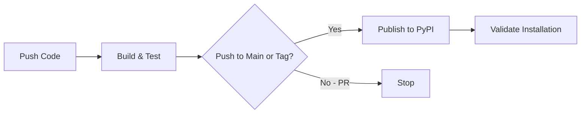

# Azure Bootstrap Library - AI Assistant Context

> Complete context for AI assistants working on the Azure Bootstrap library repository.

## Repository Purpose

This repository contains the **Azure Bootstrap Library** - a production-ready pip package that provides unified bootstrap functionality for Azure Functions applications across multiple organizations.

**Package Name**: `azure-bootstrap`
**Version**: 1.0.0
**Language**: Python 3.11+
**Distribution**: PyPI (public)

## What This Library Does

The Azure Bootstrap library solves the **circular dependency problem** between logging and configuration in Azure Functions applications:

1. **Bootstrap Logging** - Provides logging that works immediately, before configuration is loaded
2. **Configuration Loading** - Loads from Azure App Configuration with automatic Key Vault secret resolution
3. **Telemetry Setup** - Configures Application Insights with OpenTelemetry
4. **Environment Loading** - Loads all configs to `os.environ` with smart local override support

### The Problem It Solves

**Chicken-and-egg problem**:
- Configuration loading needs logging to track progress
- Logging (App Insights) needs configuration to initialize
- Can't load either without the other!

**Our Solution**:
1. Start with console logging (always works)
2. Try App Insights from environment if available
3. Load configuration from App Config/Key Vault
4. Upgrade to App Insights if connection string now available
5. Load all configs to os.environ

## Repository Structure

```
azure-bootstrap/
├── azure_bootstrap/              # Main package (distributable)
│   ├── __init__.py                   # Public API - all exports here
│   ├── py.typed                      # PEP 561 type hints marker
│   ├── models/
│   │   ├── exceptions.py             # Exception definitions
│   │   └── __init__.py
│   ├── repositories/
│   │   ├── enhanced_config_repository.py    # App Config + Key Vault
│   │   ├── secrets_repository.py            # Key Vault secrets
│   │   └── interfaces/
│   │       ├── enhanced_config_repository_interface.py
│   │       └── secrets_repository_interface.py
│   └── services/
│       ├── application_bootstrap.py         # Main orchestrator
│       ├── bootstrap_logging.py             # Bootstrap phase logging
│       ├── telemetry.py                     # App Insights telemetry
│       └── interfaces/
│           ├── application_bootstrap_interface.py
│           ├── bootstrap_logger_interface.py
│           └── telemetry_manager_interface.py
│
├── test/                             # Test suite (82% coverage)
│   ├── repositories/
│   └── services/
│
├── examples/                         # Usage examples
│   ├── function_app_example.py
│   └── local.settings.json.example
│
├── .github/workflows/ci-cd.yml       # GitHub Actions CI/CD
├── .githooks/                        # Git hooks (pre-commit, pre-push)
├── .vscode/                          # VS Code workspace config
├── pyproject.toml                    # Package metadata & build config
├── MANIFEST.in                       # Distribution file control
├── README.md                         # Library documentation
├── CLAUDE.md                         # AI assistant & developer context
├── CONTRIBUTING.md                   # Contribution guidelines
└── LICENSE                           # License file
```

## Key Concepts

### 1. Bootstrap Flow (4 Phases)

```python
# Phase 1: Bootstrap Logging
BootstrapLogger.configure_bootstrap_logging()
# → Console logging works immediately

# Phase 2: Initial Telemetry
telemetry_manager.configure()
# → Try App Insights from APPLICATIONINSIGHTS_CONNECTION_STRING env var

# Phase 3: Configuration Loading
config_repo = create_enhanced_config_repository(
    app_config_connection_string=conn_str,
    auto_load_to_environ=True
)
# → Load from Azure App Configuration
# → Resolve Key Vault references
# → Load all to os.environ

# Phase 4: Telemetry Upgrade
telemetry_manager.try_upgrade_from_config(config_repo)
# → Upgrade to App Insights if connection string now available
```

### 2. Configuration Precedence (Hierarchical)

**Priority Order** (highest to lowest):
1. **Environment variables** (`os.environ`) - Local overrides ALWAYS win
2. **Azure App Configuration** - Centralized config
3. **Key Vault secrets** (via App Config references) - Secure secrets
4. **Default values** - Fallback

**Example**:
```python
# local.settings.json sets:
USE_MOCK_DB = "true"

# App Config has:
USE_MOCK_DB = "false"
NEW_SETTING = "value"

# After initialize_application():
os.getenv("USE_MOCK_DB")  # → "true" (local preserved!)
os.getenv("NEW_SETTING")   # → "value" (remote added)
```

### 3. Automatic Key Vault Resolution

App Configuration can reference Key Vault secrets:

```json
// In App Config:
{
  "DATABASE_PASSWORD": {
    "uri": "https://myvault.vault.azure.net/secrets/db-password"
  }
}

// After bootstrap:
os.getenv("DATABASE_PASSWORD")  // → Actual secret value (not URI)
```

### 4. Graceful Fallbacks

- Missing App Configuration → Use environment variables only
- Missing Key Vault → Use environment variables only
- Missing App Insights → Use console logging only
- Import errors → Graceful warnings, continue with reduced functionality

## Public API

### Main Functions (99% of users only need these)

```python
from azure_bootstrap import initialize_application, get_bootstrap_logger

# Get logger that works immediately
logger = get_bootstrap_logger(__name__)

# Bootstrap application
config_repo = initialize_application()

# All configs now in os.environ
```

### Core Classes (Advanced usage)

```python
from azure_bootstrap import (
    ApplicationBootstrap,          # Bootstrap orchestrator
    EnhancedConfigRepository,      # Config repository
    SecretsRepository,             # Key Vault secrets
    TelemetryManager,              # Telemetry manager
    telemetry_manager,             # Singleton instance
)
```

### Interfaces (Type hints & custom implementations)

```python
from azure_bootstrap.repositories.interfaces import (
    EnhancedConfigRepositoryInterface,
    SecretsRepositoryInterface,
)
from azure_bootstrap.services.interfaces import (
    ApplicationBootstrapInterface,
    TelemetryManagerInterface,
)
```

## Development Workflow

### Setup Development Environment

```bash
# Clone repository
git clone https://github.com/TheViziusGroup/azure-bootstrap
cd azure-bootstrap

# Create virtual environment
python -m venv .venv
.venv\Scripts\activate  # Windows

# Install in editable mode with dev dependencies
pip install -e ".[dev]"
```

### Run Tests

```bash
# Run all tests with coverage
pytest

# Run specific test
pytest test/services/test_application_bootstrap.py -v

# Generate coverage report
pytest --cov=azure_bootstrap --cov-report=html
```

### Build Package

```bash
# Install build tools
pip install build

# Build wheel and sdist
python -m build

# Output:
# dist/azure_bootstrap-1.0.0-py3-none-any.whl
# dist/azure_bootstrap-1.0.0.tar.gz
```

### Publish to PyPI

```bash
# Manual publish
pip install twine
twine upload dist/*

# Or push to main (automated via pipeline)
git push origin main
```

## Code Guidelines

### Import Conventions

```python
# ALWAYS use package imports (never relative)
from azure_bootstrap.services.bootstrap_logging import BootstrapLogger

# NOT this:
from .bootstrap_logging import BootstrapLogger
```

### Public API Exports

All public API must be exported in `azure_bootstrap/__init__.py`:

```python
# azure_bootstrap/__init__.py
from azure_bootstrap.services.application_bootstrap import (
    initialize_application,  # Main function
    create_enhanced_config_repository,
)

__all__ = [
    "initialize_application",
    "create_enhanced_config_repository",
    # ... all public exports
]
```

### Interface Pattern

All core components implement interfaces:

```python
# 1. Define interface
class TelemetryManagerInterface(ABC):
    @abstractmethod
    def configure(self) -> None:
        pass

# 2. Implement interface
class TelemetryManager(TelemetryManagerInterface):
    def configure(self) -> None:
        # Implementation
        pass

# 3. Use interface for type hints
def use_telemetry(manager: TelemetryManagerInterface) -> None:
    manager.configure()
```

### Error Handling

Use custom exceptions from `models.exceptions`:

```python
from azure_bootstrap.models.exceptions import ConfigurationError

raise ConfigurationError("Config not found: DATABASE_HOST")
```

### Logging Pattern

```python
logger.info(
    "Processing started",
    extra={
        "operation": "operation_name",
        "component": "ComponentName",
        "custom_field": value,
    }
)
```

## Testing Guidelines

### Test Structure

```python
class TestApplicationBootstrap:
    def setup_method(self):
        """Setup before each test."""
        self.original_env = os.environ.copy()

    def teardown_method(self):
        """Cleanup after each test."""
        os.environ.clear()
        os.environ.update(self.original_env)

    def test_specific_behavior(self):
        """Test description."""
        # Arrange
        os.environ["KEY"] = "value"

        # Act
        result = function_under_test()

        # Assert
        assert result == expected
```

### Mocking Pattern

```python
@patch("azure_bootstrap.services.application_bootstrap.telemetry_manager")
def test_with_mock(mock_telemetry):
    mock_telemetry.configure.return_value = None
    # Test code
```

### Coverage Requirements

- Minimum: 80% overall coverage
- Current: 82.43% overall coverage
- New code: 90% coverage
- Run: `pytest --cov=azure_bootstrap --cov-report=term-missing`

## CI/CD Pipeline

### Pipeline Stages

1. **Build** - Install dependencies, run tests, build package
2. **Publish** - Upload to PyPI (main branch only)
3. **Validate** - Test installation from feed

### Triggers

- **Push to main** → Full pipeline with publish
- **Pull requests** → Build and test only
- **Tags (v*)** → Full pipeline with publish

### Pipeline Configuration

See `azure-pipelines.yml` for complete configuration.

## Version Management

### Semantic Versioning

- **Major (X.0.0)** - Breaking API changes
- **Minor (0.X.0)** - New features (backwards compatible)
- **Patch (0.0.X)** - Bug fixes

### Release Process

1. Update version in `pyproject.toml`
2. Update version in `azure_bootstrap/__init__.py`
3. Update Version History in CLAUDE.md
4. Commit and tag: `git tag v1.0.0`
5. Push: `git push origin main --tags`
6. Pipeline automatically publishes to PyPI

## Common Tasks

### Adding a New Feature

1. Create feature branch: `git checkout -b feature/new-feature`
2. Add code to appropriate module
3. Add tests (maintain 80%+ coverage)
4. Update `azure_bootstrap/__init__.py` if public API
5. Update Version History in CLAUDE.md
6. Create PR

### Fixing a Bug

1. Create bugfix branch: `git checkout -b bugfix/issue-description`
2. Add failing test that reproduces bug
3. Fix bug
4. Ensure test passes
5. Update Version History in CLAUDE.md
6. Create PR

### Updating Dependencies

1. Update `pyproject.toml` dependencies section
2. Test with new versions: `pip install -e ".[dev]"`
3. Run full test suite: `pytest`
4. Update Version History in CLAUDE.md
5. Create PR

## Troubleshooting

### Tests Failing

```bash
# Clean environment
rm -rf .venv
python -m venv .venv
.venv\Scripts\activate
pip install -e ".[test]"
pytest -v
```

### Import Errors in Tests

Check that all imports use `azure_bootstrap` prefix:

```bash
# Find any old src imports
grep -r "from src\." .
```

### Build Fails

```bash
# Check package structure
python -m build --sdist --wheel --outdir dist/ .

# Verify no syntax errors
python -m py_compile azure_bootstrap/**/*.py
```

### Package Import Fails

```bash
# Verify package installed
pip show azure-bootstrap

# Test import
python -c "from azure_bootstrap import initialize_application; print('OK')"
```

## Related Projects

This library is used across 17+ repositories:

- **Service A** - AI Assistant + Vector Store Manager
- **Service B** - Excel Operations Processor
- **Service C** - Email Ingestion Service
- ... (13 more)

See the Migration Guide section in README.md for converting projects to use this library.

## Dependencies

### Core Dependencies

```toml
azure-appconfiguration-provider >= 1.0.0
azure-keyvault-secrets >= 4.7.0
azure-identity >= 1.15.0
azure-monitor-opentelemetry >= 1.2.0
opentelemetry-api >= 1.22.0
opentelemetry-instrumentation-azure-functions >= 0.45b0
```

### Optional Dependencies

```toml
# dev - Development tools
pytest >= 7.4.0
pytest-cov >= 4.1.0
black >= 23.7.0
ruff >= 0.0.285

# test - Testing only
pytest >= 7.4.0
pytest-cov >= 4.1.0
pytest-mock >= 3.11.1
```

## Key Files Reference

| File | Purpose |
|------|---------|
| **azure_bootstrap/__init__.py** | Public API exports - ALWAYS update when adding public functions |
| **pyproject.toml** | Package metadata, dependencies, build configuration |
| **MANIFEST.in** | Controls what gets included in distribution |
| **.github/workflows/ci-cd.yml** | GitHub Actions CI/CD workflow |
| **README.md** | Library documentation, API reference, migration guide |
| **CONTRIBUTING.md** | Git workflow, quality standards, tooling setup |

## Documentation for Users

When users install this library, they should read:

1. **README.md** - Complete usage documentation
2. **examples/function_app_example.py** - Working example
3. **README.md § Migration Guide** - If converting existing project

## Quick Reference

### Most Common User Pattern

```python
from azure_bootstrap import initialize_application, get_bootstrap_logger

_bootstrap_initialized = False
_logger = None

def _ensure_bootstrap():
    global _bootstrap_initialized, _logger
    if _bootstrap_initialized:
        return

    _logger = get_bootstrap_logger(__name__)
    config_repo = initialize_application()
    _bootstrap_initialized = True

# Use in Azure Functions
app = func.FunctionApp()

@app.route(route="hello")
def hello(req):
    _ensure_bootstrap()
    # All configs in os.environ
```

## Support

- **Repository**: https://github.com/TheViziusGroup/azure-bootstrap
- **Issues**: https://github.com/TheViziusGroup/azure-bootstrap/issues
- **PyPI**: https://pypi.org/project/azure-bootstrap/

---

**For AI Assistants**: This is a library development repository. When helping users:
- Maintain 80%+ test coverage
- Follow interface-based design patterns
- Keep public API clean and simple
- Update Version History (below) for all changes
- Ensure backwards compatibility (SemVer)
- Test thoroughly before suggesting changes

---

## Historical Context

This library was extracted from a production Azure Functions application that processes payroll data using AI (Azure OpenAI) and semantic search (Azure AI Search). The original application had bootstrap code embedded in `src/infrastructure/` that handled logging, configuration, and telemetry. This code was identical across 17+ repositories, so it was extracted into this standalone pip library to provide a single source of truth. The original application README and CLAUDE.md are preserved in git history for reference.

---

## CI/CD Setup & Troubleshooting

The library uses **GitHub Actions** for CI/CD, publishing to **PyPI** (public).

### Workflow Overview



### Workflow Stages

1. **Build & Test** (every push/PR): Install Python 3.11, run pytest with 80% coverage, build wheel + sdist
2. **Publish** (main/tags only): Upload package to PyPI via Trusted Publisher or API token
3. **Validate**: Install from PyPI, verify imports work

### Version Strategy

| Branch | Version Format | Example |
|--------|---------------|---------|
| `main` | Stable | `1.0.0` |
| `develop` | Dev + timestamp | `1.0.0.dev20250124123456` |
| `v*` tags | Stable | `1.0.0` |

### GitHub Actions Setup for PyPI Publishing

**Option A: Trusted Publishers (recommended)**
1. Go to [PyPI](https://pypi.org) → Your Account → **Publishing**
2. Add a new **pending publisher** (or configure on existing package):
   - Owner: `TheViziusGroup`
   - Repository: `azure-bootstrap`
   - Workflow: `ci-cd.yml`
   - Environment: `pypi` (optional)
3. No secrets needed — GitHub Actions authenticates via OIDC

**Option B: API Token**
1. Go to [PyPI](https://pypi.org) → Account Settings → **API tokens**
2. Create a token scoped to the `azure-bootstrap` project
3. Add GitHub Secret: `PYPI_API_TOKEN` = [token value]

### Publishing Logic

```yaml
# Only publish on push (not PRs) to main or tags
if: github.event_name == 'push' && (github.ref == 'refs/heads/main' || startsWith(github.ref, 'refs/tags/'))
```

### Using Published Packages

```bash
# Install from PyPI (no extra config needed)
pip install azure-bootstrap

# Install specific version
pip install azure-bootstrap==1.0.0

# Install pre-release (dev builds)
pip install azure-bootstrap --pre
```

### CI/CD Troubleshooting

#### Authentication Failed (403 Forbidden)
- If using Trusted Publishers: verify workflow name, repo owner, and environment match PyPI config
- If using API token: verify `PYPI_API_TOKEN` secret exists and hasn't been revoked

#### Package Not Found After Publishing
- PyPI indexing is usually instant, but wait a few seconds and retry
- Verify package at https://pypi.org/project/azure-bootstrap/

#### Workflow Not Running
- Verify `.github/workflows/ci-cd.yml` exists
- Check branch names match triggers (`main`, `develop`)
- Enable Actions: **Settings** → **Actions** → **General** → "Allow all actions"

#### Version Conflicts
- Clear pip cache: `pip cache purge`
- Install specific version: `pip install azure-bootstrap==1.0.0`

---

## Version History

All notable changes to the Azure Bootstrap library.

Format based on [Keep a Changelog](https://keepachangelog.com/en/1.0.0/), adheres to [Semantic Versioning](https://semver.org/spec/v2.0.0.html).

### [1.0.0] - 2026-04-09

Initial public release of the Azure Bootstrap library (MIT license, published to PyPI).

#### Features
- Core bootstrap functionality for Azure Functions applications
- Azure App Configuration integration with automatic config loading
- Azure Key Vault integration with automatic secret resolution
- Application Insights telemetry with OpenTelemetry support
- Bootstrap logging that works before configuration is loaded
- Smart configuration precedence (local overrides remote)
- Automatic loading of all configs to `os.environ`
- Graceful fallbacks for local development
- LOG_LEVEL environment variable support
- ExtraFieldsFormatter for structured console logging
- Comprehensive error handling with custom exception hierarchy
- Full type hints and interface definitions
- 80%+ test coverage

#### Security
- Pinned minimum versions for transitive dependencies with known CVEs:
  - `azure-core>=1.38.0` - CVE-2026-21226
  - `filelock>=3.20.3` - CVE-2025-68146, CVE-2026-22701
  - `urllib3>=2.6.3` - CVE-2026-21441

#### Dependencies
- azure-appconfiguration-provider >= 1.0.0
- azure-keyvault-secrets >= 4.7.0
- azure-identity >= 1.15.0
- azure-monitor-opentelemetry >= 1.2.0
- opentelemetry-api >= 1.22.0

### Roadmap

Planned features:
- Support for Azure App Configuration feature flags
- Configuration refresh with polling
- Metrics collection and export
- Custom telemetry processors
- Configuration validation schemas
- Support for multiple Key Vaults
- Configuration change notifications

### Version Guidelines

- **Major (X.0.0)**: Breaking API changes, removal of deprecated features
- **Minor (0.X.0)**: New features (backwards compatible), deprecation warnings
- **Patch (0.0.X)**: Bug fixes, documentation updates, security dependency updates

---

**End of Documentation**
